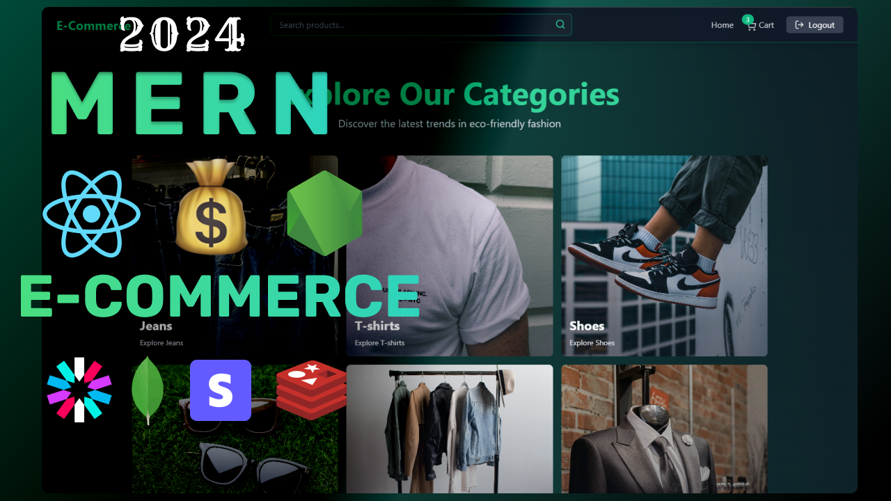

<h1 align="center">E-Commerce Store 🛒</h1>

<p align="center">
  
</p>

## 📋 Table of Contents
- [About](#about)
- [Features](#features)
- [Tech Stack](#tech-stack)
- [Architecture](#architecture)
- [Prerequisites](#prerequisites)
- [Installation](#installation)
- [Environment Variables](#environment-variables)
- [Running the Application](#running-the-application)
- [Project Structure](#project-structure)
- [API Endpoints](#api-endpoints)
- [Screenshots](#screenshots)
- [Author](#author)
- [License](#license)

## 📖 About

This is a full-featured E-Commerce Store built with the MERN stack (MongoDB, Express.js, React, Node.js). The application provides a complete shopping experience with user authentication, product management, shopping cart functionality, payment processing, and admin dashboard with analytics.

## ✨ Features

### User Features
- 🔐 User authentication (signup/login/logout)
- 🛍️ Browse products by categories
- 🔍 Search and filter products
- 🛒 Add/remove items from cart
- 🏷️ Apply coupon codes for discounts
- 💳 Secure checkout with Stripe payment integration
- 📦 View order history
- 🎁 Receive gift coupons after purchases

### Admin Features
- 👑 Admin dashboard with authentication
- 📊 Sales analytics and data visualization
- 📦 Product management (create, read, update, delete)
- 🏷️ Toggle featured products
- 👥 User management
- 📈 Real-time sales tracking

### Technical Features
- 🔐 JWT-based authentication with access/refresh tokens
- 🚀 Redis caching for improved performance
- 🛡️ Security best practices (password hashing, input validation)
- 🎨 Responsive design with Tailwind CSS
- 🌟 Smooth animations with Framer Motion
- 🗄️ MongoDB for data storage
- ☁️ Cloudinary for image storage
- 💰 Stripe for payment processing

## 🛠️ Tech Stack

### Frontend
- **React 18** - JavaScript library for building user interfaces
- **Vite** - Fast build tool and development server
- **Tailwind CSS** - Utility-first CSS framework
- **Framer Motion** - Animation library for React
- **React Router** - Declarative routing for React
- **Zustand** - Small, fast state management solution
- **Axios** - Promise based HTTP client
- **React Hot Toast** - Notification library

### Backend
- **Node.js** - JavaScript runtime environment
- **Express.js** - Web application framework
- **MongoDB** - NoSQL database
- **Mongoose** - MongoDB object modeling tool
- **Redis** - In-memory data structure store
- **JWT** - JSON Web Tokens for authentication
- **Stripe** - Payment processing API
- **Cloudinary** - Cloud-based image and video management

### DevOps
- **Nodemon** - Development server with auto-restart
- **ESLint** - JavaScript linting utility
- **PostCSS** - CSS processing platform

## 🏗️ Architecture

```
MERN E-Commerce Store
├── Frontend (React + Vite)
│   ├── Pages (Home, Login, Signup, Admin, etc.)
│   ├── Components (ProductCard, CartItem, Navbar, etc.)
│   ├── Stores (Zustand state management)
│   └── Lib (Axios configuration)
├── Backend (Node.js + Express)
│   ├── Controllers (Business logic)
│   ├── Models (Mongoose schemas)
│   ├── Routes (API endpoints)
│   ├── Middleware (Authentication, etc.)
│   └── Lib (Database connections, external services)
└── Database
    ├── MongoDB (Primary database)
    └── Redis (Caching layer)
```

## 📋 Prerequisites

Before you begin, ensure you have the following installed:
- Node.js (v14 or higher)
- MongoDB
- Redis
- npm or yarn
- Stripe account (for payment processing)
- Cloudinary account (for image storage)

## 🚀 Installation

1. Clone the repository:
```bash
git clone https://github.com/your-username/e-commerce-store.git
cd e-commerce-store
```

2. Install backend dependencies:
```bash
npm install
```

3. Install frontend dependencies:
```bash
cd frontend
npm install
cd ..
```

## ⚙️ Environment Variables

Create a `.env` file in the root directory with the following variables:

```env
# Server Configuration
PORT=5000
NODE_ENV=development

# Database Configuration
MONGO_URI=your_mongodb_connection_string
REDIS_URL=your_redis_connection_string

# JWT Configuration
ACCESS_TOKEN_SECRET=your_access_token_secret
REFRESH_TOKEN_SECRET=your_refresh_token_secret

# Client Configuration
CLIENT_URL=http://localhost:5173

# Stripe Configuration
STRIPE_SECRET_KEY=your_stripe_secret_key

# Cloudinary Configuration
CLOUDINARY_CLOUD_NAME=your_cloudinary_cloud_name
CLOUDINARY_API_KEY=your_cloudinary_api_key
CLOUDINARY_API_SECRET=your_cloudinary_api_secret
```

## ▶️ Running the Application

### Development Mode

1. Start the backend server:
```bash
npm run dev
```

2. In a new terminal, start the frontend development server:
```bash
cd frontend
npm run dev
```

3. Open your browser and navigate to `http://localhost:5173`

### Production Mode

1. Build the frontend:
```bash
cd frontend
npm run build
cd ..
```

2. Start the server:
```bash
npm start
```

## 📁 Project Structure

```
e-commerce-store/
├── backend/
│   ├── controllers/     # Business logic
│   ├── lib/            # Database connections and external services
│   ├── middleware/     # Authentication and other middleware
│   ├── models/         # Mongoose models
│   ├── routes/         # API routes
│   └── server.js       # Entry point
├── frontend/
│   ├── public/         # Static assets
│   ├── src/
│   │   ├── components/ # React components
│   │   ├── lib/        # Utility functions
│   │   ├── pages/      # Page components
│   │   ├── stores/     # Zustand stores
│   │   ├── App.jsx     # Main app component
│   │   └── main.jsx    # Entry point
│   ├── index.html      # HTML template
│   └── vite.config.js  # Vite configuration
├── .env                # Environment variables
├── .gitignore          # Git ignore file
└── README.md           # This file
```

## 🌐 API Endpoints

### Authentication
- `POST /api/auth/signup` - User registration
- `POST /api/auth/login` - User login
- `POST /api/auth/logout` - User logout
- `POST /api/auth/refresh-token` - Refresh access token

### Products
- `GET /api/products` - Get all products (admin only)
- `GET /api/products/featured` - Get featured products
- `GET /api/products/category/:category` - Get products by category
- `GET /api/products/recommendations` - Get recommended products
- `GET /api/products/random` - Get random products
- `POST /api/products` - Create a new product (admin only)
- `PATCH /api/products/:id` - Toggle featured status (admin only)
- `DELETE /api/products/:id` - Delete a product (admin only)

### Cart
- `GET /api/cart` - Get user's cart items
- `POST /api/cart` - Add item to cart
- `PUT /api/cart/:id` - Update item quantity
- `DELETE /api/cart` - Remove item from cart

### Coupons
- `GET /api/coupons` - Get user's coupon
- `POST /api/coupons/validate` - Validate coupon code

### Payments
- `POST /api/payments/create-checkout-session` - Create Stripe checkout session
- `POST /api/payments/checkout-success` - Handle successful checkout

### Analytics
- `GET /api/analytics` - Get analytics data (admin only)

## 📸 Screenshots

### Home Page


### Product Categories

*Note: Placeholder image - actual screenshot to be added*

### Shopping Cart

*Note: Placeholder image - actual screenshot to be added*

### Admin Dashboard

*Note: Placeholder image - actual screenshot to be added*

### Checkout Process

*Note: Placeholder image - actual screenshot to be added*

## 👤 Author

**Hafiz Adem**
- Email: hafizadem71@gmail.com
- Portfolio: https://hafizcreative.netlify.app
- GitHub: https://github.com/gothicreative
- LinkedIn: linkedin.com/in/hafiz-adem-054561237

## 📄 License

This project is licensed under the MIT License - see the [LICENSE](LICENSE) file for details.

---

<p align="center">Made with ❤️ by Hafiz Adem</p>
<p align="center"> just do it </ p>